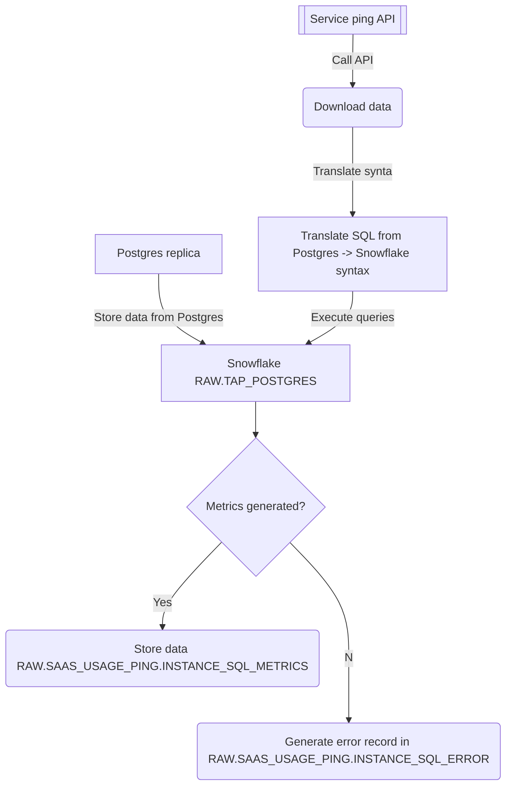
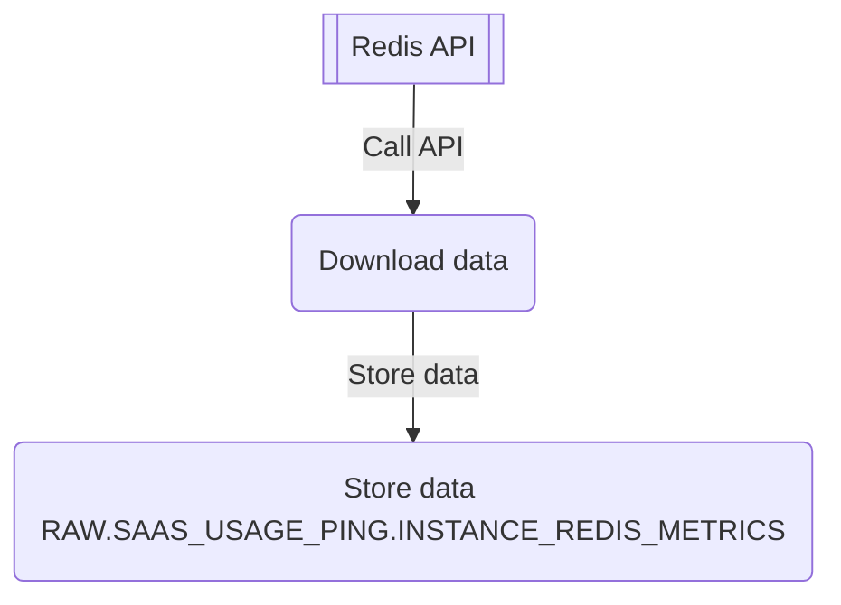

## SaaS Service Ping

SaaS `Service Ping` (formerly known as `usage ping`) is collected from self-installed instances of GitLab for those instances that have the feature enabled. This feature allows GitLab to understand usage data for self-installed instances broken down on an instance and namespace level.

`GitLab.com`, which is essentially a GitLab-hosted version of `GitLab`, has sent usage ping data in the past, but this process had problems:
* The service ping process from `GitLab.com` took too long to run _(6-8 hours on average)_
* Running the same queries in the SaaS instance as other instances resulted in data that was not granular enough. Data was needed from the namespace grain for better analytics.

This extract addresses these issues:  

* This extract offloads the SaaS service ping process in `Airflow` and `Snowflake`, it doesn't take production resources to complete.  The queries may still be long-running and costly, but `Snowflake` is much better suited for large data transformations such as the service ping queries.  Additionally, the data team can monitor durations and costs on this draft dashboard [here](https://app.periscopedata.com/app/gitlab/839683/SaaS-Usage-Ping-Monitoring) to ensure that the costs stay within acceptable bounds. 

* This extract runs queries for the namespace level so that metrics can be gathered in fine enough detail to serve the product and technical account manager teams.

Please review the [public-facing handbook page for SaaS Service Ping](https://about.gitlab.com/handbook/business-technology/data-team/data-catalog/saas-service-ping-automation/) for more information about this process.

### Technical Implementation

#### Saas service ping
The SaaS service pings are generated by iterating through a series of `SQL` queries and running them in the `Snowflake` data warehouse. 
Data in `Snowflake` schema `RAW.TAP_POSTGRES` are nothing but a mimic from `Postgres` replica we loaded under another `DAG'.

`SQL` queries we executed on `RAW.TAP_POSTGRES` the schema are translated from `Postgres` to `Snowflake` SQL syntax.
The results of the queries are then uploaded into the `RAW.SAAS_USAGE_PING` schema in Snowflake database _(data is stored in `.json` file format)_.  

`SQL data` is originally saved in `Postgres Sql` syntax format, downloaded using `RESTful API` technology: The queries are version controlled in the very large `.json` files present within this extract. The queries are split out into two categories: 
- `instance queries` and 
- `namespace queries`. 
    
The `instance queries` generate data about GitLab.com as a whole, while the `namespace queries` generate data about each namespace on GitLab.com.
Data is stored in the table: 
- `RAW.SAAS_USAGE_PING.INSTANCE_SQL_METRICS` - this data is generated results of `SQL` queries
- `RAW.SAAS_USAGE_PING.INSTANCE_SQL_ERROR` - this table contains `SQL` commands where error pops-up with the error description. If there is any record in this table, means some `SQL` query failed with an execution and the `Data team` will be alerted - via logs in `Airflow` and in [Trusted data framework (`TDF`)](https://about.gitlab.com/handbook/business-technology/data-team/platform/#tdf). 
- `RAW.SAAS_USAGE_PING.GITLAB_DOTCOM_NAMESPACE` - namespace data is stored in this table 

##### Graphical representation of the pipeline for `INSTANCE_SQL_METRICS`:

#### Redis data

One more kind of data is uploaded for the `service_ping` - data from `Redis` instance are also uploaded using `RESTful API` technology . 
`Redis data` is picked up and stored in a `.json` format, with an approximate size is around `2k` lines, usually one file per load _(at the moment, it is a weekly load)_.

The main purpose of loading data from Redis is to ensure fine granulation of metrics.

Data is stored in the table:
- `RAW.SAAS_USAGE_PING.INSTANCE_REDIS_METRICS` - this data is generated results of `RESTful API` call

##### Graphical representation of the pipeline for `INSTANCE_REDIS_METRICS`:

        
### Backfilling SaaS Service Ping

There is also a process in place to recreate SaaS service pings from the past.
There is a separate backfill `DAG` that allows back filling service pings for the last `12` months.
The process backfills by filtering the queries to only those that query over a specific timeframe, and then passing in the month it is backfilling for as the timeframe.
As a future iteration, we may add the ability to backfill metrics that do not query just over a specific timeframe _(all-time metrics)_.
