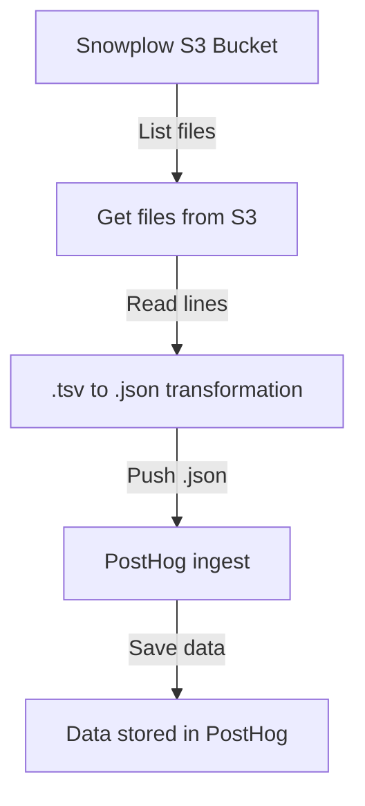

# Snowpolow - Posthog back-fill

## Motivation 

Create a new PH Snowplow Loader program to feed the Snowplow JSON files in S3 to the PH Snowplow Adapter.
Our goal is to have new Snowplow files fed into PostHog as often as possible (min hourly). 
You can read about the [Existing Snowplow load process in the handbook](https://about.gitlab.com/handbook/business-technology/data-team/platform/snowplow/) - perhaps this provides some ideas to leverage when building the new PH Snowplow Loader.

## Resources 

* Issue: [Build PH: Snowplow Loader (Data team) - data backfill implementation](https://gitlab.com/gitlab-data/analytics/-/issues/13055)
* Slack: [Slack #gitlab-posthog-data](https://gitlab.slack.com/archives/C02QQGGG6FJ/p1654690509663749?thread_ts=1654635836.118379&cid=C02QQGGG6FJ) the easiest way for communication with the `PostHog` team and `GitLab` IT Systems Engineers
* Recorded sessions:
    * [PostHog agreement about backfill approach](https://www.youtube.com/watch?v=k-a5a1tybWM) 

* [GitLab->PostHog Project Plan](https://docs.google.com/spreadsheets/d/1zsm-vGz1cuwO0x-5HH0grpP6Oj3c_Y6trED6A11ipDY/edit#gid=0)
* [GitLab / PostHog Regular Check-in](https://docs.google.com/document/d/1mSzO7bdJwGP2OHz7Xig1u7ZwdkqiyjhQO3v632md5nE/edit#)
* [Existing Snowplow load process in the handbook](https://about.gitlab.com/handbook/business-technology/data-team/platform/snowplow/)
* [GitLab Snowplow infrastrucure](https://docs.gitlab.com/ee/development/snowplow/infrastructure.html)


### Technical resources 

here is the list of resources needed for debug, development and troubleshooting:
* URL for the `PostHog` (POC) instance: `https://posthog-poc.gitlab.systems`
* `S3` bucket where the `SnowPlow` data are stored: 
    * URL: [gitlab-com-snowplow-events/output](https://s3.console.aws.amazon.com/s3/buckets/gitlab-com-snowplow-events?region=us-east-1&prefix=output/&showversions=false)
    * Access: you need at least a `read` access to the bucket

## POC installation

`PostHog` for POC is installed in a dedicated `GCP` cluster under `gitlab-analysis` project.
* URL: [posthog-poc-cluster](https://console.cloud.google.com/kubernetes/clusters/details/us-west1-c/posthog-poc-cluster/details?project=gitlab-analysis)
* The installation was done by `GitLab` IT Systems Engineers

## Local Installation

For the local development (only) you need to do following things:

# Backfill pipeline (`snowplow_posthog_backfill`)

DAG name: `snowplow_posthog_backfill`

For the pipeline execution we need the following resources:

## Libraries

* [posthog](https://posthog.com/docs/integrate/server/python)
```bash
pip install posthog
```
    
> **Note**: for testing and prod environment, `posthog` library was already installed under [data_image](https://gitlab.com/gitlab-data/data-image/-/blob/master/data_image/requirements.txt#L29). No action needed.
   
## Secrets and variables for the pipeline

For successful run the TEST or PROD pipeline, you should set up secrets.

#### kube secrets 
* `kube` secrets values, should be found either using:
    * `kubectl` secrets (both in `default` and `testing` namespace) and fetched with the command:
    ```
    kubectl edit secret airflow -o yaml --namespace=DESIRED_NAMESPACE # please rename the DESIRED_NAMESPACE with the real namespace
    ```
    * or you should find it in `1password`: vault = `Data Team`, item = `posthog_secrets`

Here is the list of secrets needed for `PostHog` back-filling:
* `aws_access_key_id`
* `aws_secret_access_key`
* `aws_s3_snowplow_bucket`
* `posthog_project_api_key`
* `posthog_personal_api_key `
* `posthog_host`

> **Note**:, all secrets are already set up on test and prod environment, this is just a double check what is needed. No action needed.

#### Airflow variables

* `Airflow` variables need both for `TEST` and `PROD` as well, **please add them!**
    * `POSTHOG_BACKFILL_START_DATE` (in the format: `YYYY-MM-DD` ie. `2022-04-30`)
    * `POSTHOG_BACKFILL_END_DATE` (in the format: `YYYY-MM-DD` ie. `2022-04-30`) 

## Back-filling pipeline representation

Below is the representation of the pipeline mechanism and how data is ingested from `Snowplow` S3 Bucket to `PostHog`.



## Known issues

### What can go wrong? 

From what we know here is the list of potential issue can happen:
* `PostHog` [can't accept records](https://gitlab.com/gitlab-data/analytics/-/issues/13055#note_1010756609)
    * **Action**: ping the `PostHog` team in Slack and ask for support
* [Bad performance when ingest data](https://gitlab.com/gitlab-data/analytics/-/issues/13055#note_1010079665) to `PostHog` - either it is too slow or `DAG` failed due to slow ingesting into the `PostHog`. This is the most significant issue happened as our part of processing - getting the data from `S3` and transform from `.tsv` to `.json` is acceptable think.
    * The entire load **without** pushing data to PostHog is done around `20-30` minutes for 1 day of data. Details [here](https://gitlab.com/gitlab-data/analytics/-/issues/13055#note_1008150746). During the weekend, amount of data is significantly lower than on workdays. 
    * **Action**: Ping `GitLab` IT Systems Engineers in Slack [#gitlab-posthog-data](https://gitlab.slack.com/archives/C02QQGGG6FJ/p1654690509663749?thread_ts=1654635836.118379&cid=C02QQGGG6FJ) channel 
* Any other issue with the pipeline
    * **Action**: check the code for the pipeline `/snowplow_posthog/bakfill.py` and debug it, the previous chapter can help you with the flow explained

### Status

* [2022-06-29](https://gitlab.com/gitlab-data/analytics/-/issues/13055#note_1011120938)
* [2022-06-30](https://gitlab.com/gitlab-data/analytics/-/issues/13055#note_1013038593)
* [2022-07-01](https://gitlab.com/gitlab-data/analytics/-/issues/13055#note_1013039540)

## Facts

* There are plenty of data per day (`~45M` records approx. per day)
* Data in airflow are loaded per day (each task is separated per day)
* Each row is transformed from .tsv to .json file format
* Data is transformed and pushed to PostHog using [Python PostHoglibrary](https://posthog.com/docs/integrate/server/python) as the producer [suggested](https://posthog.com/docs/integrate/ingest-historic-data)
* Data volume [benchmark](https://gitlab.com/gitlab-data/analytics/-/issues/13055#note_1012031398) explained the volume of data and rough estimation about the throughout
* The current project for data back-fill point to `test_data_team_backfill` project - for prod load, probably should go into `Default` (or some other project), need to check with the business. If you want to switch the project, please alter the secret `posthog_project_api_key`. 
This can be done following the steps:
    * Go to https://posthog-poc.gitlab.systems
    * Under the section `project` on the left top side choose the project you want to ingest data
    * Press the `Settings` _(wheel icon next to the project name)_
    * Go to Section `Project Variables` and pick up the value under `Project API Key`

## Testing PostHog python library locally

In order to check does PostHog instance accept the ingestion, here is the simple script how to push `1` record to the `PostHog` instance.
This is needed for **local** testing. 

Install needed library for testing (as this is optional, but handy):
* [python-decouple](https://pypi.org/project/python-decouple/)

```python
pip install python-decouple
```

You need to have `.env` file in order to save secrets. Secrets should be found as it is described in [kube secrets](#### kube secrets) section.  
```dotenv
posthog_project_api_key=**********
posthog_personal_api_key=**********
posthog_host=https://***********
```

This also can be done as a part of environment variables.

```python
"""
Test mode to check PostHog backfilling with one record

Resources: https://posthog.com/docs/integrate/server/python
"""

from datetime import datetime
import posthog
from decouple import config

from dateutil.tz import tzutc

# get config properties - in this case, picked up from .env file
posthog.project_api_key = config("posthog_project_api_key")
posthog.personal_api_key = config("posthog_personal_api_key")
posthog.host = config("posthog_host")

# Optional
# posthog.debug = True


posthog.capture(
    "gitlab_dotcom",
    event="test_table_backfill",
    properties={"id": "123", "category": "gitlab_events"},
    timestamp=datetime.utcnow().replace(tzinfo=tzutc()),
)

```

If you run above script and everything passed fine, you should ensure the record landed where it is needed.
1. Go to `https://posthog-poc.gitlab.systems`
2. Open project `test_data_team_backfill`
3. Click `Live Events`
4. You should see your record added `a second ago`
