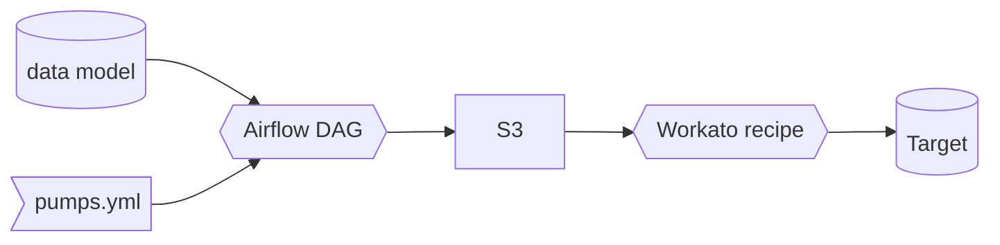

# Data Pump

TL;DR: For copying data to S3_DATA_PUMP bucket for outbound warehouse integrations by adding models to pumps.yml

## Introduction

In order to make it easy for anyone to send data from Snowflake to other applications in the GitLab tech stack we have partnered with the Enterprise Applications Integration Engineering team to create this data integration framework, which we are calling Data Pump. The Data Pump [Airflow DAG](https://airflow.gitlabdata.com/tree?dag_id=data_pumps), which runs the pump, is is set to **run once daily at 05:00 UTC**.

## Adding a Data Pump

**Step 1:** Create a data model [using dbt](https://about.gitlab.com/handbook/business-ops/data-team/platform/dbt-guide/#using-dbt) in `/marts/pumps` (or `/marts/pumps_sensitive` if the model contains [RED or ORANGE Data](https://about.gitlab.com/handbook/engineering/security/data-classification-standard.html#data-classification-levels)), following our [SQL](https://about.gitlab.com/handbook/business-ops/data-team/platform/sql-style-guide/) and [dbt](https://about.gitlab.com/handbook/business-ops/data-team/platform/dbt-guide/#style-and-usage-guide) style and documentation standards. Create an MR using dbt model changes template. Once this is merged and appears in Snowflake in `PROD.PUMPS` or `PROD.PUMPS_SENSITIVE` you are ready for steps two and three.

**Step 2:** Add Model to `pumps.yml` using the 'Pump Changes' MR template with the following attributes:
* model - the name of the model in dbt and snowflake
* timestamp_column - the name of the column that should be used to batch the data (or `null` if there is none and the table is small)
* sensitive - `True` if this model contains sensitive data and is in the pumps_sensitive directory and schema
* onwer - your (or the business DRI's) gitlab handle

**Step 3:** Create an [integration issue in the integrations project](https://gitlab.com/gitlab-com/business-ops/enterprise-apps/integrations/integrations-work/-/issues/new) using the 'New Data Pump' issue template so that the Integration team can map and integrate the data into the target application.
